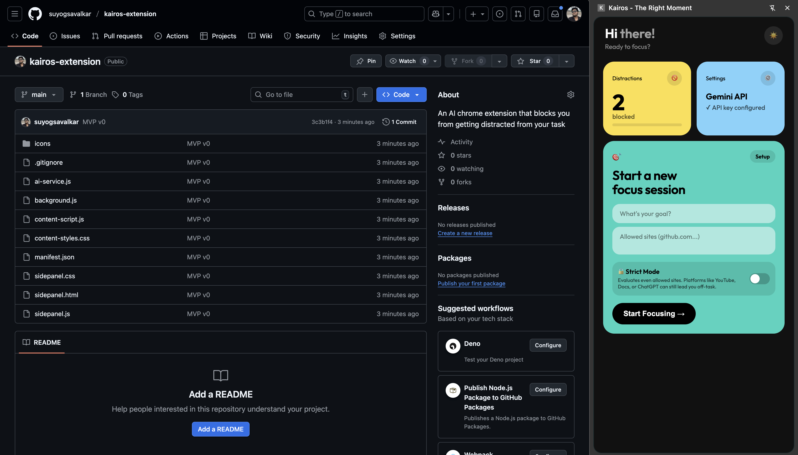

# Kairos

A Chrome extension that helps you stay focused during work sessions by using AI to evaluate and block distracting content.

## Features

- **Session-based Focus**: Set a goal and allowed sites for each focus session
- **AI-Powered Blocking**: Uses Gemini to evaluate if content is relevant to your task
- **Strict Mode**: Evaluates even allowed domains (YouTube, Docs, ChatGPT) for task relevance
- **Activity Logs**: Track blocked and allowed sites during your session
- **Smart Return**: Navigate back to your last relevant page or tab
- **Dark/Light Mode**: Modern Bento Grid UI with theme support

## Installation

1. Clone this repository
2. Open Chrome and navigate to `chrome://extensions/`
3. Enable "Developer mode"
4. Click "Load unpacked" and select the extension directory

## Setup

1. Get a Gemini API key from [Google AI Studio](https://aistudio.google.com/apikey)
2. Open the Kairos side panel
3. Click the Settings card and enter your API key
4. Start a focus session with your goal and allowed sites

## Usage

### Starting a Session

1. Enter your work goal (e.g., "Write project documentation")
2. Add allowed sites (e.g., `github.com, docs.google.com`)
3. Toggle Strict Mode if you want AI to evaluate even allowed sites
4. Click "Start Focusing"

### During a Session

- Tabs not matching allowed domains are automatically hidden
- When you visit a potentially distracting page, you'll see a blocking overlay
- You can justify why you need the page or return to your task
- Activity logs show what was blocked or allowed

### Strict Mode

When enabled, even allowed domains are evaluated. This is useful for generic platforms like:
- YouTube (could be work videos or entertainment)
- Google Docs (could be work docs or personal notes)
- ChatGPT (could be work research or casual chat)

## Architecture

- `background.js` - Service worker handling session logic and AI evaluation
- `sidepanel.html/js/css` - Side panel UI for session management
- `content-script.js` - Blocking overlay injected into pages
- `ai-service.js` - Gemini API integration

## License

MIT
